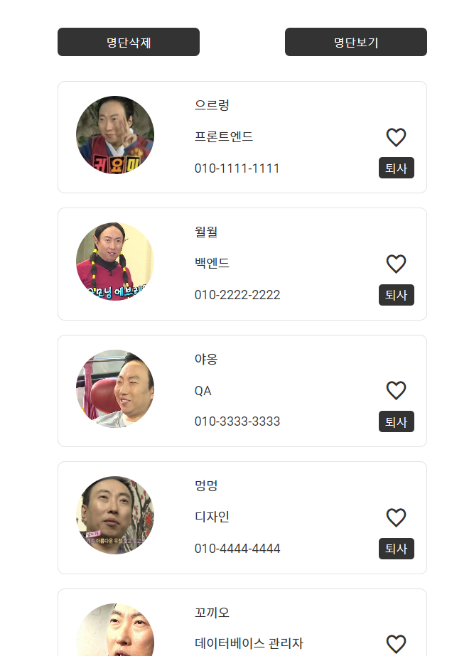
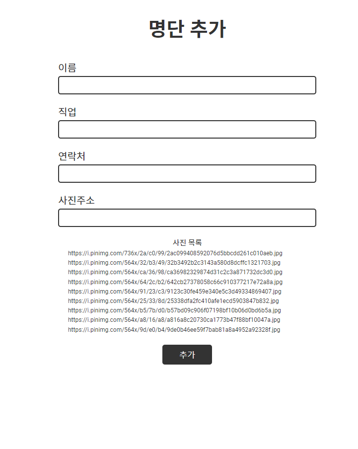

# peopleList(JS 모듈화 연습)

import와 export를 이용한 모듈화 연습
localStorage를 이용한 명단 관리(v5)

-  script type을 module로

```
  ...
  <script src="./app.js" type="module"></script>
</body>
```

-  연습 코드 중 import 예시

```
// export default 일때
import makeList from './module/makeList.js';
// export default 아닐때
import { get, getAll } from './module/getEle.js';
```

-  연습 코드 중 export 예시

```
// 선언해두고 추후 export
const tempFunc = () => {}
export default tempFunc;

// 바로 export
export default () => {}
```

## 결과




## v1

### 구조

-  app.js
-  index.html

### 설명

모듈화 없이 단일 js로 작업

## v2

### 구조

-  module`<span style="color:red">` (New)
   -  data.js`<span style="color:red">` (New)
-  app.js
-  index.html

### 설명

'module' 폴더를 만들어서 data값만 'data.js'로 모듈화

## v3

### 구조

-  module
   -  data.js
   -  makeList.js`<span style="color:red">` (New)
   -  iconEvent.js`<span style="color:red">` (New)
-  app.js
-  index.html

### 설명

list의 내용을 만드는 부분을 'makeList.js'로 모듈화
아이콘의 이벤트 부분을 'iconEvent.js'로 모듈화

## v4

### 구조

-  module
   -  data.js
   -  makeList.js
   -  iconEvent.js
   -  getEle.js`<span style="color:red">` (New)
-  app.js
-  index.html

### 설명

querySelector와 querySelectorAll를 'getEle.js'로 모듈화

## v5

### 구조

-  module
   -  tempData.js`<span style="color:red">` (New)
   -  getEle.js
   -  list.js`<span style="color:red">` (New)
-  app.js
-  index.html

### 설명

localStorage를 사용해서 명단의 변동사항을 localStorage에 저장합니다
관련기능들을 class List로 만들어 list.js에 모듈화 했습니다

_app.js_

```
const listContainer = get('.list-container');

const list = new List(listContainer);
list.init(tempData);

```

_list.js(class List)_

```
show()
localStorage에 저장된 데이터값으로 화면에 출력합니다

add()
입력 받은 값으로 localStorage에 저장합니다

delList()
화면상에서 목록을 지웁니다

iconEvent(e)
아이콘 클릭시 isLike가 토글되며, 해당 데이터의 isLike상태를 변경 후 localStorage에 저장합니다

resignation(e)
퇴사버튼 클릭시 localStorage데이터에서 해당 데이터를 삭제합니다

picError(e)
저장된 img url이 정상적이지 않으면 해당 데이터의 이미지를 대체이미지로 바꿉니다
```

_코드 사용_
const list = new List(사용할 최상위 컨테이너);
list.init(초기데이터 공백시 []);

## v6

### 설명

리액트로 작업
localStorage는 아직 배우지 않아서 기능제거
useState, useRef로 작업
